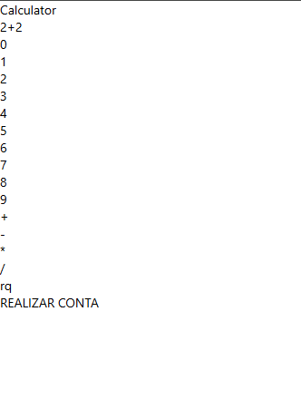
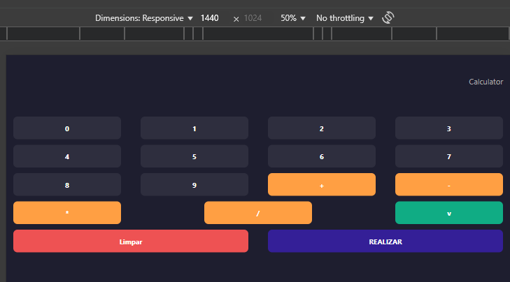

Print inicial do Projeto:
   

Print de segunda entrega (ainda possui erros nas funções):
   
   
Requisitos:
   -  O Sistema deve ser capaz de capturar do usuário 1 número, 1 operador e outro número.
   -  Os operadores disponíveis devem ser os de Soma, Subtração, Multiplicação, Divisão e Raiz Quadrada.
   -  O Sistema deve ser capaz de realizar a operação deseja com os 2 números informados.